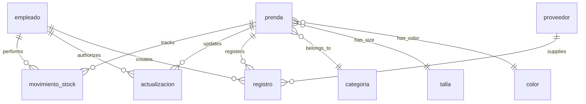

## Database Architecture

The TiendaRopa database is designed to manage a clothing store's inventory, employee operations, supplier relationships, and product catalog. The schema follows a normalized relational design pattern with clear separation of concerns.

**Database Name:** `tienda_ropa`  
**Character Set:** UTF8MB4  
**Collation:** utf8mb4_general_ci  
**Engine:** InnoDB (transactional tables)

## Entity Relationship Overview

The database consists of 8 core tables organized around three primary domains:

### Core Domains

1. **Product Management**
   - `prenda` (garment/item) - Central product catalog
   - `categoria` - Product categories
   - `talla` - Size variants
   - `color` - Color options

2. **Operations & Inventory**
   - `movimiento_stock` - Stock movements (entries, exits, adjustments)
   - `actualizacion` - Price update history

3. **Business Relationships**
   - `empleado` - Employee records
   - `proveedor` - Supplier information
   - `registro` - Product registration linking items to suppliers

## Tables Summary

<CardGroup cols={2}>
  <Card title="prenda" icon="shirt" href="./tables/prenda">
    Core product catalog with pricing, stock, and variant information
  </Card>
  
  <Card title="categoria" icon="tags" href="./tables/categoria">
    Product categories (Caballero, Dama, Infantil, Deportiva, Accesorios)
  </Card>
  
  <Card title="color" icon="palette" href="./tables/color">
    Color catalog for product variants (Negro Nocturno, Azul Marino, etc.)
  </Card>
  
  <Card title="talla" icon="ruler" href="./tables/talla">
    Size options for clothing items (ch, m, g, ech, eg)
  </Card>
  
  <Card title="empleado" icon="user" href="./tables/empleado">
    Employee records with roles (gerente, empleado)
  </Card>
  
  <Card title="proveedor" icon="truck" href="./tables/proveedor">
    Supplier contact and location information
  </Card>
  
  <Card title="movimiento_stock" icon="arrows-rotate" href="./tables/movimiento-stock">
    Inventory movements tracking entries, exits, and adjustments
  </Card>
  
  <Card title="actualizacion" icon="clock-rotate-left" href="./tables/actualizacion">
    Historical record of price changes with audit trail
  </Card>
  
  <Card title="registro" icon="file-lines" href="./tables/registro">
    Product registration records linking items to suppliers
  </Card>
</CardGroup>

## Key Relationships

### Primary Foreign Key Relationships



### Relationship Details

| Parent Table | Child Table | Relationship | Constraint Name |
|--------------|-------------|--------------|------------------|
| `prenda` | `movimiento_stock` | One-to-Many | `fk_mov_prenda` |
| `prenda` | `actualizacion` | One-to-Many | `fk_act_prenda` |
| `prenda` | `registro` | One-to-Many | `fk_reg_prenda` |
| `empleado` | `movimiento_stock` | One-to-Many | `fk_mov_emp` |
| `empleado` | `actualizacion` | One-to-Many | `fk_act_emp` |
| `empleado` | `registro` | One-to-Many | `fk_reg_emp` |
| `proveedor` | `registro` | One-to-Many | `fk_reg_prov` |
| `categoria` | `prenda` | One-to-Many | `fk_prenda_cat` |
| `talla` | `prenda` | One-to-Many | `fk_prenda_talla` |
| `color` | `prenda` | One-to-Many | `fk_prenda_color` |

## Design Philosophy

### Normalization
The database follows Third Normal Form (3NF) principles:
- Product attributes (category, size, color) are separated into lookup tables
- Transactional data (movements, updates) maintains historical integrity
- No redundant data storage except for denormalized audit fields

### Audit Trail
The system maintains comprehensive audit capabilities:
- `movimiento_stock.fecha` - Timestamp of inventory changes
- `actualizacion.precio_anterior` / `precio_nuevo` - Price change history
- `registro.fecha_registro` - Product registration timestamps
- All transactional tables reference `id_empleado` for accountability

### Indexing Strategy
Strategic indexes improve query performance:
- **Primary Keys:** Auto-increment integers on all tables
- **Foreign Key Indexes:** Automatic indexes on all FK columns
- **Search Indexes:** `idx_prenda_nombre` for product name searches
- **Composite Indexes:** `idx_prenda_cat_talla` for filtered queries
- **Date Indexes:** `idx_movimiento_fecha` for temporal queries

### Data Integrity
Multiple layers ensure data quality:
- Foreign key constraints enforce referential integrity
- `NOT NULL` constraints on critical fields
- `DEFAULT` values for timestamps (CURRENT_TIMESTAMP)
- `UNIQUE` constraint on `proveedor.telefono`
- Decimal precision for monetary values (10,2)

## Common Query Patterns

### Inventory Status
```sql
SELECT p.nombre, p.stock_actual, c.nombre as categoria
FROM prenda p
INNER JOIN categoria c ON p.id_categoria = c.id_categoria
WHERE p.stock_actual < 20
ORDER BY p.stock_actual ASC;
```

### Price History
```sql
SELECT p.nombre, a.fecha, a.precio_anterior, a.precio_nuevo,
       (a.precio_nuevo - a.precio_anterior) as cambio,
       e.nombre as empleado
FROM actualizacion a
INNER JOIN prenda p ON a.id_prenda = p.id_prenda
INNER JOIN empleado e ON a.id_empleado = e.id_empleado
ORDER BY a.fecha DESC;
```

### Stock Movements by Employee
```sql
SELECT e.nombre, COUNT(*) as total_movimientos,
       SUM(CASE WHEN m.tipo_movimiento = 'entrada' THEN m.cantidad ELSE 0 END) as entradas,
       SUM(CASE WHEN m.tipo_movimiento = 'salida' THEN m.cantidad ELSE 0 END) as salidas
FROM movimiento_stock m
INNER JOIN empleado e ON m.id_empleado = e.id_empleado
GROUP BY e.id_empleado, e.nombre;
```

## Database Statistics

Based on the sample data:
- **5 Categories:** Caballero, Dama, Infantil, Deportiva, Accesorios
- **5 Employees:** Mix of gerentes and empleados
- **5 Suppliers:** Local Aguascalientes providers
- **20+ Products:** Various clothing items across categories
- **20+ Stock Movements:** Tracking inventory changes since October 2025
- **6 Price Updates:** Historical price adjustments
- **6 Registration Records:** Product-supplier relationships
